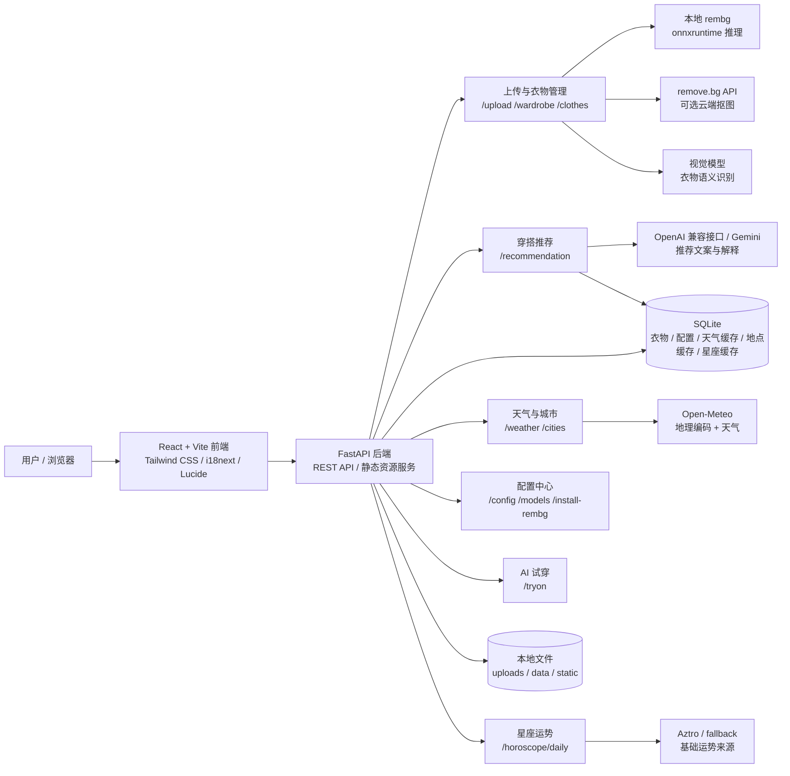
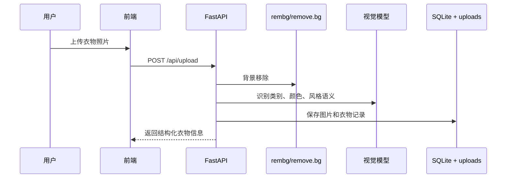
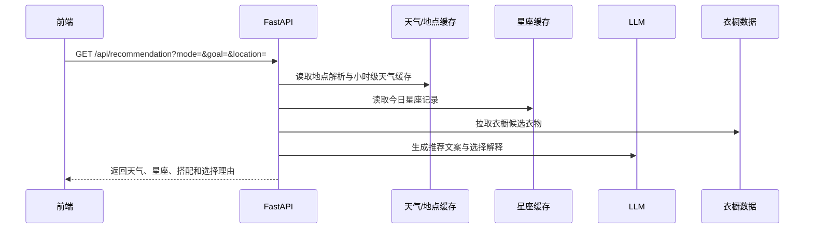

<div align="center">

# AI 智能衣橱

[](https://github.com/leoz9/AIWardrobe/stargazers)
[](LICENSE)
[](https://ghcr.io/leoz9/aiwardrobe)
[](https://python.org)
[](https://nodejs.org)
[](https://fastapi.tiangolo.com)
[](https://react.dev)
[](https://tailwindcss.com)

**面向日常穿搭的 AI 衣橱管理、天气感知推荐与本地隐私抠图工具。**

上传衣物照片后，系统可以自动去除背景、识别衣物类别与风格语义，并结合天气、星座运势、场景目标和衣橱库存生成可解释穿搭建议。

[简体中文](./README.md) | [English](./README.en.md) | [日本語](./README.ja.md)

---


</div>

## 项目亮点

| 能力 | 说明 |
| :--- | :--- |
| 智能录入 | 上传衣物图片后自动抠图，并用视觉模型分析类别、颜色、风格、季节和使用场景 |
| 本地离线抠图 | 支持 `rembg + onnxruntime` 本地服务端推理，图片不需要发到第三方抠图服务 |
| remove.bg 兜底 | 未安装本地依赖或需要第三方效果时，可切换到 remove.bg API |
| 天气感知推荐 | 使用 Open-Meteo 免费天气接口，按实时温度、体感、湿度、风力辅助穿搭 |
| 地点与天气缓存 | 缓存文本地点解析、小时级天气与星座记录，减少重复等待和外部请求 |
| 今日星座运势 | 根据设置中的星座生成今日运势、幸运色、幸运数字和穿搭提示 |
| 多模式推荐 | `balanced`、`goal_first`、`wardrobe_first` 三种策略，适配均衡、目标优先和库存优先 |
| 可解释选择 | 推荐结果会展示上装、下装、鞋履和配饰的选择理由 |
| 语音目标输入 | 可用语音输入通勤、约会、运动、面试等场景目标 |
| AI 试穿扩展 | 支持配置自定义 Try-On 接口，保留接入第三方试穿服务的能力 |
| OS 26 风格 UI | 采用 Liquid Glass 方向的透明、浮层、柔和边框与响应式移动端体验 |

## 架构图



## 核心数据流

### 衣物录入



### 今日推荐



## 技术栈

| 层级 | 技术 |
| :--- | :--- |
| 前端框架 | React 19、Vite 7、React Router |
| UI 与样式 | Tailwind CSS 4、Lucide React、OS 26 / Liquid Glass 风格 |
| 国际化 | i18next、react-i18next、语言检测 |
| 后端框架 | FastAPI、Uvicorn、Pydantic |
| 数据存储 | SQLite、aiosqlite、本地 uploads/data 持久化 |
| AI 能力 | OpenAI 兼容接口、Google Gemini、视觉识别、LLM 推荐 |
| 抠图能力 | 本地 `rembg + onnxruntime`、可选 remove.bg API |
| 天气能力 | Open-Meteo 天气与地理编码、地点解析缓存、天气缓存 |
| 测试 | Vitest、React Testing Library、unittest、FastAPI TestClient |
| 部署 | Docker、Docker Compose、GHCR 镜像 |

## 目录结构

```text
AIWardrobe/
├── backend/
│   ├── api/                 # FastAPI 路由：上传、衣柜、配置、天气、推荐、星座、试穿
│   ├── domain/              # 配置、衣物和提示词领域模型
│   ├── services/            # 天气、推荐、抠图、LLM、试穿等服务
│   ├── storage/             # SQLite 表结构、CRUD、配置文件
│   ├── uploads/             # 本地上传图片与处理结果
│   └── main.py              # 后端入口与静态资源托管
├── frontend/
│   ├── src/components/      # 设置、上传、底部导航等通用组件
│   ├── src/pages/           # 首页、录入、衣柜、推荐、试穿、详情页
│   ├── src/contexts/        # 上传、推荐、主题上下文
│   ├── src/i18n/            # 中英日文案
│   └── src/__tests__/       # 前端回归测试
├── docs/images/             # README 截图资源
├── Dockerfile
├── docker-compose.yml
├── start.sh
└── start.bat
```

## 快速开始

### 环境要求

- Node.js `20+`
- Python `3.10+`
- 可选：OpenAI 兼容接口 Key 或 Google Gemini API Key
- 可选：remove.bg API Key

### 本地开发启动

```bash
git clone https://github.com/leoz9/AIWardrobe.git
cd AIWardrobe

# 后端
cd backend
python -m venv venv
source venv/bin/activate   # Windows: venv\Scripts\activate
pip install -r requirements.txt
cd ..

# 前端
cd frontend
npm install
cd ..
```

一键启动：

```bash
# macOS / Linux
chmod +x start.sh
./start.sh

# Windows
start.bat
```

手动启动：

```bash
# 终端 1：后端
cd backend
source venv/bin/activate
uvicorn main:app --host 0.0.0.0 --reload --port 8000

# 终端 2：前端
cd frontend
npm run dev
```

默认访问：

- 前端开发服务：http://localhost:5173
- 后端 API：http://localhost:8000
- API 文档：http://localhost:8000/docs

## Docker 部署

### 创建管理员凭据

本版本默认启用管理员认证。未配置凭据时，健康检查仍可使用，但衣橱 API、上传图片和接口文档都会拒绝访问。

```bash
cp backend/.env.example backend/.env
python3 backend/generate_admin_secrets.py
```

按提示设置管理员用户名和至少 12 位的密码，然后把命令输出的五行配置复制到 `backend/.env`。密码只保存为 PBKDF2-SHA256 哈希，浏览器登录态使用签名的 HttpOnly Cookie。

生产环境务必使用 HTTPS；如果只允许本机或反向代理访问，可把 Compose 端口改为 `127.0.0.1:8000:8000`。

### 本地构建

```bash
docker build -t aiwardrobe:local .
docker run -d --name ai_wardrobe -p 8000:8000 \
  --env-file backend/.env \
  -v $(pwd)/backend/uploads:/app/backend/uploads \
  -v $(pwd)/backend/data:/app/backend/data \
  aiwardrobe:local
```

### Docker Compose

```bash
docker compose up --build -d
```

Compose 会挂载：

- `backend/uploads`：衣物图片、抠图结果、试穿结果
- `backend/data`：容器内 SQLite 数据库

### 关于上游预构建镜像

上游的 `ghcr.io/leoz9/aiwardrobe:latest` 不包含本仓库新增的管理员登录功能。部署管理员版本时请使用上面的 `docker compose up --build -d` 从本仓库源码构建，不要直接拉取上游镜像。

容器模式下访问：http://localhost:8000

登录成功前，所有 `/api`、`/uploads`、`/docs`、`/redoc` 与 `/openapi.json` 请求都会受到保护；`/health` 保持公开，供 Docker 健康检查使用。连续登录失败会触发临时限速。

## 配置说明

启动后进入前端设置页完成配置：

| 配置项 | 说明 |
| :--- | :--- |
| API Base | OpenAI 兼容接口地址，例如 `https://api.openai.com/v1` |
| API Key | 用于视觉识别、推荐文案、星座推理等模型调用 |
| Model | 当前使用的模型名称 |
| 默认城市 | 天气和首页信息使用的地点，建议使用“城市, 省/州, 国家”格式 |
| 星座 | 今日星座运势和幸运色推荐使用 |
| 本地 rembg | 一键安装 `rembg` 与 `onnxruntime`，安装后按钮显示“rembg 已安装” |
| remove.bg API | 可选云端抠图服务，适合不想安装本地推理依赖的部署 |
| Try-On | 可选自定义 AI 试穿接口 |

## 常用 API

| 接口 | 说明 |
| :--- | :--- |
| `POST /api/upload` | 上传衣物图片、抠图并生成语义信息 |
| `GET /api/wardrobe` | 获取衣橱列表 |
| `GET /api/clothes/{id}` | 获取衣物详情 |
| `GET /api/weather` | 获取当前天气 |
| `GET /api/cities` | 搜索城市与地点 |
| `GET /api/horoscope/daily` | 获取今日星座运势 |
| `GET /api/recommendation` | 获取今日穿搭推荐 |
| `POST /api/config` | 保存模型、天气、星座、抠图、试穿配置 |
| `POST /api/install-rembg` | 安装或检测本地 rembg 依赖 |
| `POST /api/tryon` | 调用自定义 AI 试穿接口 |

推荐接口示例：

```bash
curl "http://localhost:8000/api/recommendation?location=Shanghai,Shanghai,China&mode=goal_first&goal=commute"
```

## 测试与验证

```bash
# 后端回归测试
cd backend
venv/bin/python -m unittest test_recommendation_api

# 前端测试
cd ../frontend
npm test

# 前端 lint
npm run lint

# 前端生产构建
npm run build
```

当前测试覆盖了：

- 设置保存时避免无关天气/星座重复刷新
- 星座变化只刷新星座，不重新请求天气
- 本地 rembg 安装状态展示
- 天气缓存和地点解析缓存
- 推荐模式、目标和可解释选择理由

## 截图

<div align="center">
  
</div>

<div align="center">
<table>
<tr>
<td align="center"><br /><b>录入新衣</b></td>
<td align="center"><br /><b>我的衣橱</b></td>
</tr>
<tr>
<td align="center"><br /><b>AI 推荐</b></td>
<td align="center"><br /><b>衣物详情</b></td>
</tr>
</table>
</div>

## 许可证

[MIT](LICENSE) © 2024 leoz9
